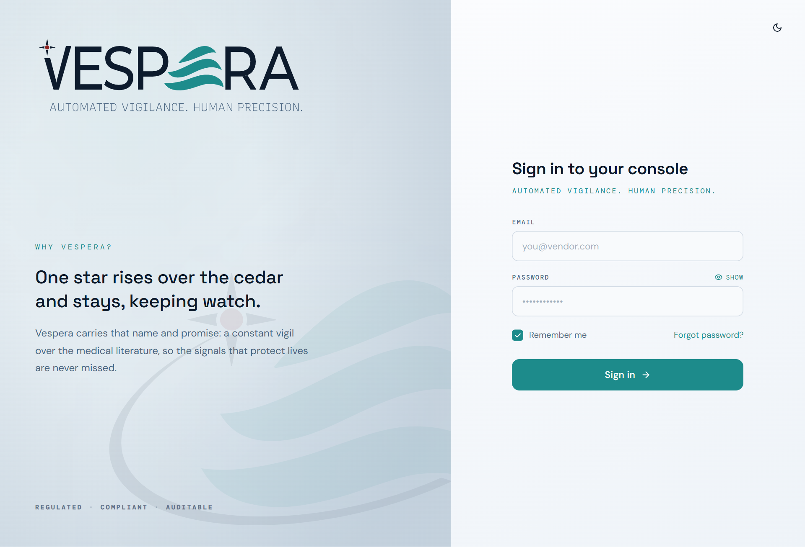
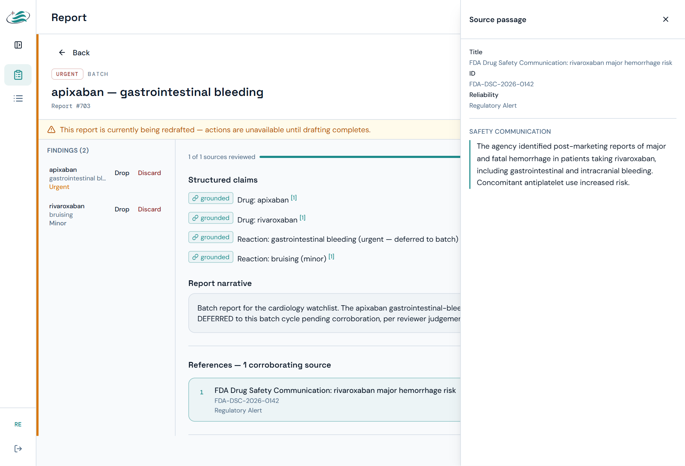
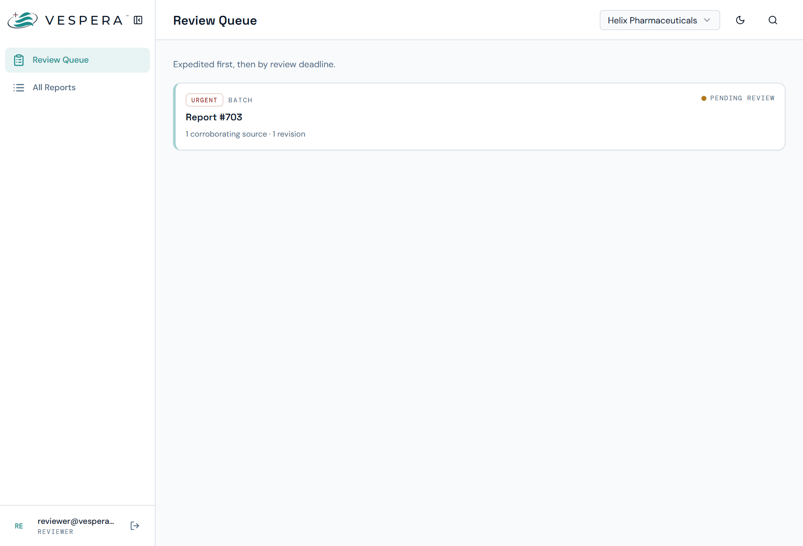
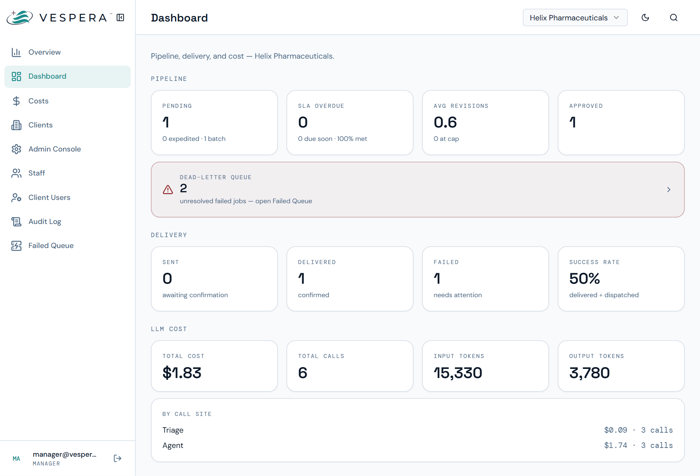
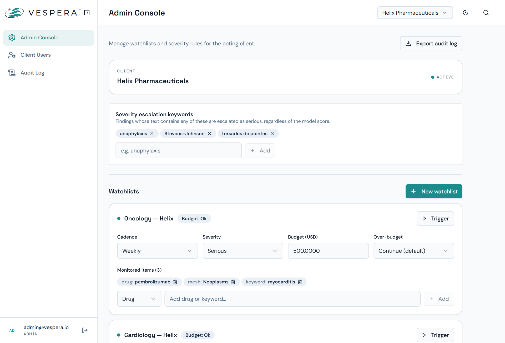
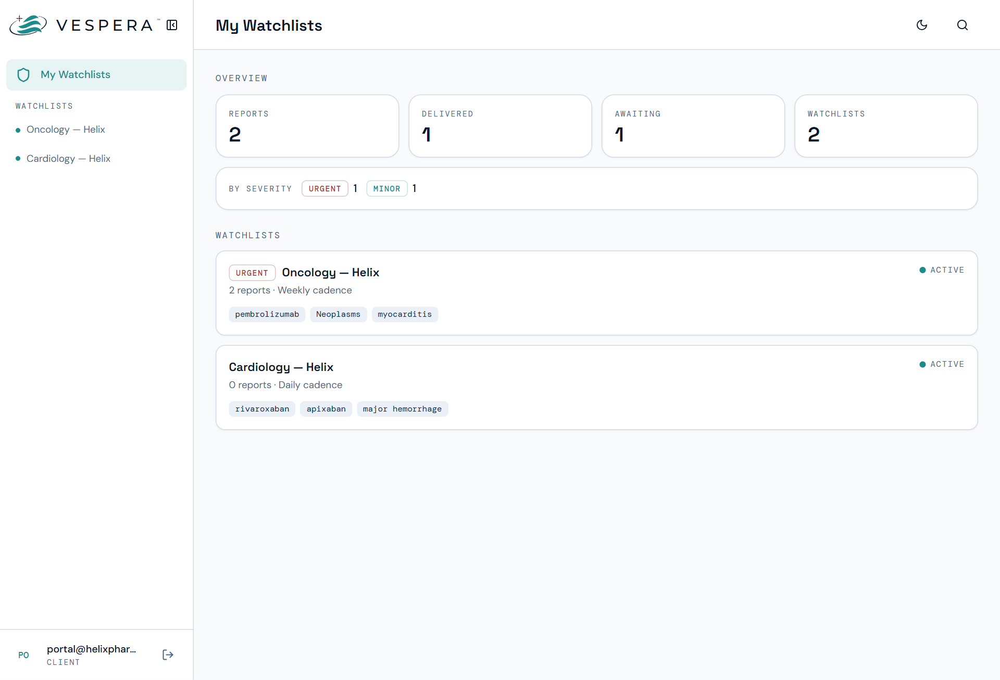

# Vespera

*Named for the evening star that rises over the cedar and keeps watch.*

**Automated pharmacovigilance literature monitoring and adverse-event signal detection.**

Vespera is a B2B SaaS platform that continuously monitors medical literature and regulatory
feeds for a client's drugs, detects adverse-event signals, and drafts grounded safety reports.
Every report is **human-reviewed before delivery** — the system triages and drafts, but a
qualified reviewer is the only authority that can authorize a send. Because its outputs feed
regulatory and clinical decision-making, grounding, tenant isolation, and auditability are
treated as non-negotiable.

> **Status:** all 13 spec-driven features are complete and merged to `master`. An ongoing
> security-audit remediation pass is layering additional hardening (right-to-erasure, triage
> fail-safe escalation, at-rest reviewer-comment redaction; migrations `0013`–`0015`).

<p align="center">
  <picture>
    <source media="(prefers-color-scheme: dark)" srcset="docs/screenshots/hero-login-dark.png">
    
  </picture>
</p>

---

## What it does

The full monitoring cadence runs hourly per watchlist as a durable pipeline:

```
ingest ──▶ index ──▶ retrieve ──▶ triage ──▶ draft ──▶ HITL review ──▶ deliver ──▶ notify
  │          │          │           │          │           │             │           │
literature  parse →   hybrid      NER →     LangGraph   reviewer      n8n email/   staff
adapters    chunk →   dense +     classify  bounded     approve/      SFTP +       SLA &
(6 sources) embed →   lexical →   severity  agent,      edit/reject/  callback     failure
            pgvector  RRF →       → route   grounded    discard                    alerts
            + tsvector rerank
```

- **Ingest** — 6 source adapters (PubMed, Europe PMC, openFDA FAERS/Labels, FDA MedWatch, EMA,
  MHRA) with cross-source dedup and per-source watermarks.
- **Index** — parse → chunk (~256 tokens) → embed (768-dim) → store dense vectors (pgvector
  HNSW) and lexical `tsvector` (GIN) for hybrid retrieval.
- **Retrieve** — dense + lexical search fused with RRF, then cross-encoder rerank, with
  corroboration counting across distinct sources.
- **Triage** — scispaCy NER → three-stage classify (model → LLM fallback → fail-safe escalate)
  → ICH severity bucketing → queue routing. **Fails safe toward escalation.**
- **Draft** — a bounded LangGraph agent drafts a report where **every claim cites its source
  passage**; ungrounded statements are refused, not fabricated.
- **Review (HITL)** — the reviewer-only approval gate: Approve / Edit-then-Approve /
  Reject-with-comment (AI redraft capped at 3 rounds) / Discard. No path bypasses it.
- **Deliver** — on approval, a durable job renders the report and dispatches to every
  configured channel (email, SFTP) via n8n, with delivery callbacks and an SLA sweep.

---

## Screenshots

<table>
  <tr>
    <td width="50%" valign="top">
      <a href="docs/screenshots/report-citations.png"></a>
      <br><sub><b>Grounded report</b> — every claim cites its source passage; the drawer shows the exact corroborating text.</sub>
    </td>
    <td width="50%" valign="top">
      <a href="docs/screenshots/reviewer-queue.png"></a>
      <br><sub><b>Reviewer queue</b> — the human-in-the-loop approval gate; expedited first, then by review deadline.</sub>
    </td>
  </tr>
  <tr>
    <td width="50%" valign="top">
      <a href="docs/screenshots/dashboard.png"></a>
      <br><sub><b>Dashboard</b> — pipeline, delivery, and LLM-cost metrics for the acting client.</sub>
    </td>
    <td width="50%" valign="top">
      <a href="docs/screenshots/admin-console.png"></a>
      <br><sub><b>Admin console</b> — watchlists, cadence, budgets, and severity-escalation keywords.</sub>
    </td>
  </tr>
  <tr>
    <td width="50%" valign="top">
      <a href="docs/screenshots/client-portal.png"></a>
      <br><sub><b>Client portal</b> — the tenant-scoped, client-facing view of delivered reports.</sub>
    </td>
    <td width="50%"></td>
  </tr>
</table>

---

## Architecture

A **modular monolith** (FastAPI app + ARQ worker) plus three deliberately-separate containers,
each with a documented justification: a no-torch inference sidecar, a security guardrails
sidecar, and the React SPA. n8n handles outbound notification/SFTP routing.

```
                         ┌─────────────┐
                         │  React SPA  │  :5173
                         └──────┬──────┘
                                │  HTTPS / Bearer JWT
                         ┌──────▼──────┐
       Vault :8200 ────▶ │   FastAPI   │  :8000
       (secrets)         │   (app/)    │
                         └──┬───┬───┬──┘
              ┌─────────────┘   │   └──────────────┐
        ┌─────▼──────┐   ┌──────▼──────┐    ┌──────▼──────┐
        │  Postgres  │   │    Redis    │    │  Guardrails │  :8002
        │ + pgvector │   │ (ARQ queue  │    │   sidecar   │
        │   :5432    │   │  + cache)   │    └─────────────┘
        └────────────┘   └──────┬──────┘
                                │
                         ┌──────▼──────┐    ┌─────────────┐
                         │ ARQ Worker  │───▶│ Modelserver │  :8001
                         │ (worker/)   │    │ (ONNX, lean)│
                         └──────┬──────┘    └─────────────┘
                                │  webhook
                         ┌──────▼──────┐
                         │     n8n     │ ──▶ email / SFTP / staff notifications
                         └─────────────┘
```

| Service | Port | Role |
|---|---|---|
| FastAPI API (`app/`) | 8000 | REST API, auth, routing, in-process pipeline orchestration |
| ARQ Worker (`worker/`) | — | Durable job execution + hourly scheduler cron |
| Modelserver (`modelserver/`) | 8001 | Lean, torch-free ONNX classifier + embedder + reranker (<500 MB) |
| Guardrails sidecar (`guardrails/`) | 8002 | Injection / jailbreak / topic-scope / cross-client rails |
| Frontend SPA (`frontend/`) | 5173 | React 18 + Vite client for all 4 user types |
| Postgres + pgvector | 5432 | Relational store, vector + full-text search, row-level security |
| Redis | 6379 | ARQ queue + query-embedding cache |
| Vault | 8200 | The only home for real secrets (fetched at startup via `hvac`) |
| n8n | external | Outbound email / SFTP delivery + staff notification routing |

---

## Tech stack

- **Python 3.12**, managed with [`uv`](https://docs.astral.sh/uv/) (reproducible lockfile).
- **FastAPI** + **SQLAlchemy 2 (async)** + **Alembic** + **asyncpg**.
- **Postgres 16 / pgvector** (HNSW dense + GIN lexical), **Redis** (+ **ARQ** worker).
- **LangGraph** bounded agent; **Anthropic / OpenAI** LLM providers (pinned, behind retries).
- **ONNX Runtime** serving (no torch in any serving container); **scispaCy** NER; **Presidio**
  egress redaction.
- **HashiCorp Vault** for secrets; **structlog** JSON logging; **Sentry** with PII off.
- **React 18 + Vite + TypeScript** SPA (see [`frontend/README.md`](frontend/README.md)).
- **n8n** for delivery/notification routing.

---

## Repository layout

```
app/            FastAPI modular monolith — one package per domain:
                auth, clients, ingestion, embedding (index build), rag (retrieval),
                triage, agent + reports (drafting + HITL), delivery, scheduling,
                redaction, guardrails (client), audit, observability, core, db, domain
worker/         ARQ worker entrypoint (durable jobs + scheduler cron)
modelserver/    Lean ONNX inference container (classifier / embedder / reranker)
guardrails/     Torch-free security guardrails sidecar
frontend/       React + Vite SPA
eval/           Golden sets + eval runners (classifier, RAG, triage, agent, scheduling)
scripts/        Operator scripts (seed_admin, seed_client, model artifacts, db role init)
specs/          Spec-driven design artifacts per feature (spec → plan → tasks → research)
docs/           Project documentation (see Documentation below)
tests/          unit/ + integration/ (integration needs the live stack)
notebooks/      Offline model training/export (torch — never in serving images)
```

---

## Quickstart (local)

Full instructions, per-feature run guides, and troubleshooting live in
[`docs/RUNBOOK.md`](docs/RUNBOOK.md). The short version:

```bash
# 1. Bootstrap config (only VAULT_ADDR / VAULT_TOKEN — never real secrets)
cp .env.example .env

# 2. Bring up the backing services
docker compose up -d vault postgres redis

# 3. Write secrets into Vault (database_url, redis_url, anthropic_api_key / openai_api_key, …)
#    See docs/RUNBOOK.md → "Local (Docker Compose)" for the Vault CLI command.

# 4. Apply the schema (in-container so hostnames resolve)
docker compose run --rm api alembic upgrade head

# 5. Start the full stack
docker compose up -d
curl http://localhost:8000/health        # → {"status":"ok"}

# 6. Bootstrap the first admin (idempotent)
docker compose run --rm api python scripts/seed_admin.py
```

Then open the SPA at <http://localhost:5173>. Log in via `POST /auth/jwt/login` (form
`username`=email, `password`); send the JWT as `Authorization: Bearer <token>`.

**Requirements:** Docker + Docker Compose, and (for backend dev) Python 3.12 + `uv`. Secrets
**only** ever live in Vault — there is no `.env` for secret values.

---

## Testing & quality gates

```bash
uv run pytest                          # unit + stack-free tests
VESPERA_INTEGRATION=1 uv run pytest    # also runs tests needing the live stack
uv run ruff check . && uv run black --check app worker tests   # lint (both must pass)
```

Quality is enforced by **committed eval gates** (every product decision is backed by a number
in `eval_thresholds.yaml`):

- Classifier macro-F1 ≥ 0.80
- RAG golden set: hit@5 ≥ 0.85, MRR ≥ 0.70, corroboration accuracy ≥ 0.75
- Triage golden set: recall ≥ 0.90, precision ≥ 0.75, FN ≤ FP (safety bias)
- Agent tool-selection + grounding / prompt-injection red-team
- Redaction leak = 0; guardrails block-rate = 1.0
- ≥ 80% line coverage overall (95%+ on classifier, HITL, auth, DB writes)

The frontend has its own Vitest + Playwright suites (see [`frontend/README.md`](frontend/README.md)).

---

## Security & compliance highlights

- **Human-in-the-loop is non-negotiable** — nothing is delivered without logged reviewer approval.
- **Grounding is the grade** — every report claim cites a source passage; ungrounded claims are refused.
- **Multi-tenant isolation** — every row is `client_id`-scoped, enforced at both the repository and
  RAG-retrieval layers and backed by Postgres **row-level security** (least-privilege `vespera_app` role).
- **Secrets only in Vault** — fetched at startup via `hvac`; gitleaks runs pre-commit and in CI.
- **Egress redaction** — Presidio redacts PII/secrets before any external-LLM call, log, or trace.
- **Guardrails** — every LLM-facing call passes injection / jailbreak / topic-scope / cross-client rails.
- **Atomic, append-only audit log** + **right-to-erasure** (purges rows, vectors, sessions; audited).

See [`docs/SECURITY.md`](docs/SECURITY.md) and [`docs/DECISIONS.md`](docs/DECISIONS.md) for detail.

---

## Documentation

All project documentation lives in [`docs/`](docs/):

| Document | What's inside |
|---|---|
| [docs/RUNBOOK.md](docs/RUNBOOK.md) | Operating guide — local + production bring-up, and per-feature run/monitor instructions (auth, watchlists, ingestion, index build, retrieval, triage, worker, guardrails, RLS). |
| [docs/delivery-runbook.md](docs/delivery-runbook.md) | Report delivery lifecycle, n8n routing, SLA sweep, and staff notifications. |
| [docs/DECISIONS.md](docs/DECISIONS.md) | Architecture and model decisions, with the numbers that justify them (the classifier bake-off, HNSW vs IVFFlat, the guardrails/RLS/redaction design, …). |
| [docs/SECURITY.md](docs/SECURITY.md) | Foundation security posture: secrets, transport/edge, logging, audit, startup validation. |
| [docs/COMPLEXITY.md](docs/COMPLEXITY.md) | Algorithmic complexity of the classifier, retrieval, and index build. |
| [docs/FUTURE_IMPROVEMENTS.md](docs/FUTURE_IMPROVEMENTS.md) | Scoped-out enhancements and the backlog, with where each came from. |
| [frontend/README.md](frontend/README.md) | SPA development, build, and test. |
| [specs/](specs/) | Per-feature design artifacts (spec → plan → tasks → research → data-model → contracts) for all 13 features. |

---

## Governing principles

Vespera is built spec-first ("own every line; no vibe coding"). Seven non-negotiable
principles govern the system: human-in-the-loop authority, grounding is the grade, triage
fails safe, every decision is backed by a number, multi-tenant isolation & data protection,
lean/reproducible/justified architecture, and spec-driven development. They are the contract
that the eval gates and architecture above enforce.
